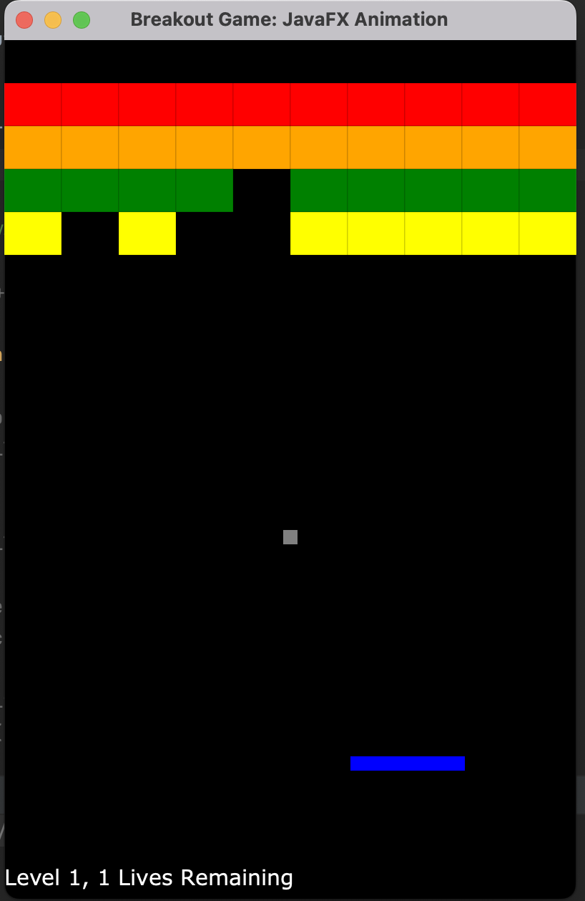

# SimpleBreakoutGame

Made Java program (with OpenJFX, GIT, Markdown, IntelliJ) that allows someone to play the Breakout game, in which a ball bounces around the window and destroys blocks as it hits them.

### Features
- Brick breaks when intersecting around the vicinity of the top left of the ball.
- Paddle can be controlled by arrow keys and mouse, and can stop at edges to not go off the screen.
- Text field labeling when game is over, how many lives you are on, and what level you are on.
- 3 levels based on text input, and semantic change to indicate game is over afterwards.

### Running the Program
- Main class: Main.java
- Data files needed: level1.txt, level2.txt, level3.txt
- Key/Mouse inputs: RIGHT, LEFT, UP, DOWN, W, S, A, D, L, R
- Cheat keys: Shift paddle left and right, grow paddle, shrink paddle, grow ball, shrink ball, Randomly recolor ball, Randomly recolor paddle, Add a life, Reset the ball

### Assumptions
I made an assumption that the brick breaks when intersecting around the vicinity of the top left of the ball/rectangle, which was an assumtion to simplify the ball class and the collision method's design.

### How to Add New Levels
In order to make a new level, all one has to do is add a text file to the Resources folder with the format level_.txt with their specification for levels, where each row in the text file is a row of bricks, and 1 represents a brick present and 0 represents no brick present. One thing I wasn't able to add by the deadline but would be pretty cool is a way to create a randomly generated text file with rows of 1s and 0s to generate a randomized level for the user.

#### Level 1 Bricks: 
1 1 1 1 1 1 1 1 1 1

1 1 1 1 1 1 1 1 1 1

1 1 1 1 1 1 1 1 1 1

1 1 1 1 1 1 1 1 1 1

#### Level 2 Bricks: 

0 1 0 1 0 1 0 1 0 1

0 1 0 1 0 1 0 1 0 1

0 1 0 1 0 1 0 1 0 1

0 1 0 1 0 1 0 1 0 1

#### Level 3 Bricks: 

1 0 1 0 1 0 1 0 1 0

0 1 0 1 0 1 0 1 0 1

1 0 1 0 1 0 1 0 1 0

0 1 0 1 0 1 0 1 0 1

For this CompSci 308 class project on 1/18/22: https://courses.cs.duke.edu/spring22/compsci308/assign/01_game/
